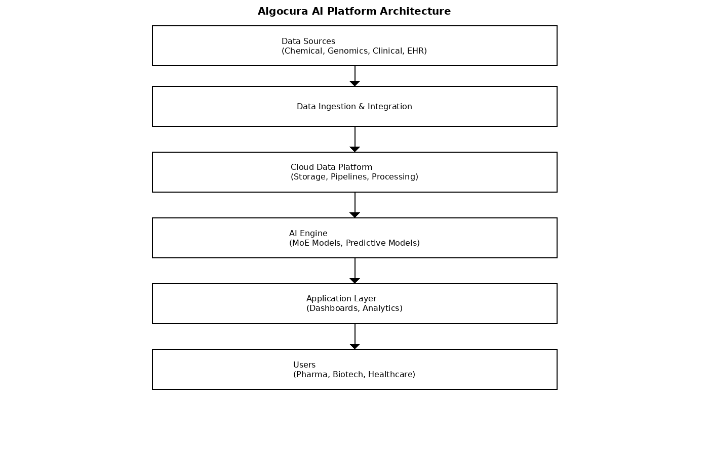

# Algocura BioTech AI Platform Prototype

> This repository presents a conceptual system architecture prototype for the Algocura BioTech platform, demonstrating the technical design, workflow, and implementation approach of an AI-driven system for automating drug discovery workflows and healthcare data processes.

---

## Overview

Algocura BioTech LLC is focused on advancing and optimizing drug discovery and healthcare systems through AI-driven automation and scalable cloud-based architecture.

This prototype outlines a system designed to:
- Support computational drug discovery workflows
- Enhance bioinformatics data processing
- Improve healthcare data integration and analytics
- Enable efficient, scalable, and compliant operations

---

## System Architecture

### Core Components

- **AI Drug Discovery Engine**
- **Bioinformatics Processing Layer**
- **Cloud Data Platform**
- **Healthcare Integration Layer (EHR Systems)**
- **Predictive Analytics Module**
- **Security & Compliance Layer**

---

## Architecture Diagram



```
Data Sources → Ingestion → Cloud Platform → AI Engine → Applications → Users
```

---

## System Workflow

### 1. Data Ingestion
- Integration of chemical, genomic, and clinical datasets
- Connection to EHR systems and external APIs

### 2. Data Processing
- Data normalization and transformation
- Preparation for AI model processing

### 3. AI Processing
- Application of Mixture of Experts (MoE) models
- Computational screening of chemical spaces
- Candidate prediction and scoring

### 4. Analysis & Prioritization
- Ranking of potential drug candidates
- Reduction of false positives using ensemble techniques

### 5. Output & Visualization
- Interactive dashboards for researchers
- Actionable insights and reporting tools

---

## Key Features

### AI-Driven Drug Discovery
- Supports identification of drug candidates through computational analysis
- Enables large-scale screening of chemical spaces

### Bioinformatics Integration
- Supports genomic and proteomic analysis
- Enables biomarker and target identification

### Predictive Analytics
- Forecasts patient outcomes and risks
- Supports healthcare resource optimization

### Cloud-Based Infrastructure
- Scalable and secure architecture
- Real-time processing and collaboration

---

## Compliance and Security

The platform is designed to align with:

- HIPAA (Health Insurance Portability and Accountability Act)
- FDA AI/ML guidance for drug development
- Secure cloud architecture best practices

### Security Features
- End-to-end encryption
- Role-based access control (RBAC)
- Audit logging and monitoring

---

## Operational Model

### Deployment
- Cloud-native architecture (Azure / AWS)
- Microservices-based design

### Integration
- EHR systems
- Laboratory Information Management Systems (LIMS)
- External research platforms

### Scalability
- Horizontal scaling for large datasets
- Modular architecture for flexibility

---

## Use Cases

### Pharmaceutical Companies
- Support drug candidate identification
- Improve R&D efficiency

### Biotech Firms
- Analyze complex biological datasets
- Accelerate research workflows

### Healthcare Providers
- Improve patient management
- Optimize clinical decision-making

---

## Future Enhancements

- Advanced deep learning for molecular prediction
- Real-time clinical trial data integration
- Expansion into precision medicine platforms

---

## Conclusion

This prototype demonstrates a scalable AI-driven system designed to support drug discovery and healthcare operations through automation, advanced analytics, and cloud-based infrastructure.

The platform enables more efficient workflows, reduces operational costs, and supports innovation across the healthcare and pharmaceutical ecosystem.

---

## License

This project is released under the MIT License for demonstration and conceptual purposes.
